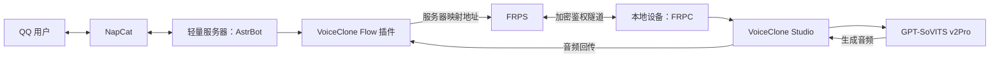

<div align="center">

# 音色工作流 

**从音视频素材到 AstrBot 语音输出的一站式 GPT-SoVITS 工作流，支持服务器本地运行、远程算力卸载与本地训练 + 远程推理等部署方式。**


[](CHANGELOG.md)
[](https://github.com/AstrBotDevs/AstrBot)
[](https://github.com/RVC-Boss/GPT-SoVITS)
[](#系统与参考配置)
[](LICENSE)

[部署方案](#部署方案) · [快速开始](#快速开始) · [VoiceClone Studio](https://github.com/TKGEKKOU/voiceclone-studio) · [核心能力](#核心能力) · [常见问题](#常见问题)

</div>

本项目基于 **GPT-SoVITS v2Pro** ，将素材处理、语音标注、GPT-SoVITS 训练、音色管理、TTS Provider 配置和语音消息输出整合为一条完整工作流。它既可以在 AstrBot 所在服务器上运行，也可以把训练与推理交给另一台高性能设备，让轻量服务器只负责常规消息通信。VoiceClone Studio 是独立应用，不包含在本插件安装包中

> [!TIP]
> **轻量服务器用户可以选择远程模式。** 单独下载 [VoiceClone Studio](https://github.com/TKGEKKOU/voiceclone-studio)到在另一台设备，按需开启 GPT-SoVITS 和 FRPC。不用语音时一键关闭，可以释放显存和后台进程，也不需要为云服务器长期配置 GPU。

> [!WARNING]
> 仅处理你本人拥有或已经获得明确授权的音视频与声音素材。

---

## 部署方案

| 方案 | AstrBot 服务器 | 另一台设备 | 适合场景 |
| --- | --- | --- | --- |
| **本地全流程** | 素材处理、训练、推理、Provider 全部运行 | 不需要 | 高性能设备直接运行 AstrBot；希望部署集中、链路最短 |
| **远程 Studio** | 运行 AstrBot、NapCat 和插件 | Studio 负责模型、音色、训练与推理 | 轻量云服务器；另一台设备有 NVIDIA GPU；希望分离算力 |
| **混合部署** | 保留消息处理和部分插件能力 | 按需承担训练、音色管理或推理 | 已有本地音色和服务器环境；需要灵活分工或逐步迁移 |

远程模式属于**控制端与算力端解耦的分布式部署**。不是多机并行训练集群：AstrBot 负责消息、会话、Provider 和 QQ 等平台用户通信，VoiceClone Studio 负责资源密集型的模型运行与音频生成。



远程模式的示例使用场景：

- 1 核 2G 等轻量服务器无需加载 GPT-SoVITS 模型。
- 本地Windows高性能设备负责 NVIDIA 驱动、CUDA、模型和音色文件，减少 Linux 服务器环境配置。
- 语音服务可按需开启；关闭后停止 GPT-SoVITS 与 Studio 管理的 FRPC。
- 音频仍由 AstrBot 的 TTS Provider 链路交给 NapCat/QQ，机器人部署方式不变。
- Token、模型路径和音色路径保留在各自设备，不要求服务器识别 Windows 文件路径。

---

## 核心能力

| 能力 | 说明 |
| --- | --- |
| 远程算力与音色同步 | 通过 FRP/HTTP(S) 调用另一台设备，自动同步音色并创建独立远程 Provider |
| GPT-SoVITS 训练 | 训练预设、自定义 Epoch、实时进度、日志和成果登记 |
| Provider 自动配置 | 本地音色配置为 `GSV TTS(Local)`；远程音色配置为 `GSVI TTS(API)` |
| 多语言组合输出 | 保留中文文字，可配合中文语音或翻译后的日语语音输出 |
| 素材生产流水线 | FFmpeg 音频提取、HT-Demucs 人声分离、VAD 切片、AstrBot STT 标注 |
| 安全与清理 | Token 鉴权、路径边界检查、临时数据和生成音频定时清理 |

---

## 快速开始

### 1. 安装插件

在 AstrBot 插件市场搜索“音色工作流”，或手动安装：

```bash
cd AstrBot/data/plugins
git clone https://github.com/TKGEKKOU/astrbot_plugin_voice_clone_flow.git
```

安装后在 AstrBot 插件管理页重载插件。

### 2A. 本地模式

1. 在插件页面选择**本地模式**。
2. 在 AstrBot“模型提供商”中启用一个 STT Provider，并在插件中选择它。
3. 准备 FFmpeg、人声分离模型和 GPT-SoVITS v2Pro 运行环境。
4. 上传素材，完成切片审核、训练数据生成和模型训练。
5. 登记音色并自动配置 `GSV TTS(Local)` Provider。


### 2B. 远程模式

1. 在目标设备上从 [VoiceClone Studio Releases](https://github.com/TKGEKKOU/voiceclone-studio/releases) 下载 Studio 并启动。
2. 在服务器插件页面选择**远程连接模式**。
3. 按 Studio 页面顺序设置 Studio Token、服务器 FRPS 地址和 FRP Token。
4. 启动 FRPC，等待 Studio 显示“远程可用”。
5. 将 Studio 生成的服务器侧地址和同一个 Studio Token 填入插件。
6. 在插件中测试连接、同步远程音色并确认远程 Provider。
7. 需要语音时在 Studio 开启“语音服务总开关”；不用时关闭以释放本地算力。

服务器插件中的“GPT-SoVITS 语音后端”在远程模式下留空。

详细端口、Token 和 NapCat/AstrBot 配置见 [通信与部署说明](docs/communication-deployment.md)。Studio API 契约见 [远程 Studio API](docs/remote-studio-api.md)。

---

## 处理与训练流程

```mermaid
flowchart LR
    Source["视频 / 音频"] --> Extract["FFmpeg 提取"]
    Extract --> Separate["HT-Demucs 分离"]
    Separate --> Segment["VAD 切片"]
    Segment --> Transcribe["STT 标注"]
    Transcribe --> Review["试听与修订"]
    Review --> Dataset["训练数据"]
    Dataset --> Train["GPT + SoVITS 训练"]
    Train --> Voice["音色成果"]
    Voice --> Provider["AstrBot TTS Provider"]
```



用户可以在训练前试听每个片段、修改 STT 文本并排除不合格素材，避免错误标注直接进入训练。

### 导入已有音色

本地插件音色可以放入：

```text
AstrBot/data/plugin_data/astrbot_plugin_voice_clone_flow/voices/
```

VoiceClone Studio 使用它自己的音色目录。打开 Studio 的“音色与试听”页面，点击“打开音色文件夹”即可导入和检查已有音色。

---

## Provider（模型提供商）接入

| 模式 | AstrBot Provider | 权重和参考音频所在位置 |
| --- | --- | --- |
| 本地 | `GSV TTS(Local)` | AstrBot 所在设备 |
| 远程 | `GSVI TTS(API)` | VoiceClone Studio 所在设备 |

本地模式会整理 GPT 权重、SoVITS 权重、参考音频、参考文本和语言，并允许用户在启用 Provider 前复核。

远程模式从 Studio 同步音色元数据，为每个音色创建独立 Provider。服务器只保存远程音色标识和 API 配置，不会检查 Studio 的 Windows 权重路径。Provider 请求通过映射地址到达 Studio，生成的音频再返回 AstrBot。

---

## 中文文字与多语言语音

| 可见文字 | 语音内容 | 输出方式 |
| --- | --- | --- |
| 中文 | 中文 | 先发送中文文字，再补发中文语音 |
| 中文 | 日语 | 保留中文文字，翻译后补发日语语音 |

长回复会按句拆分并保持原文顺序。翻译或语音合成失败时只保留文字，不会用错误语言继续合成。

远程 VoiceClone Provider 会把中文回复提交给 Studio，由 Studio 使用已配置的 OpenAI 兼容 LLM 完成翻译，再调用 GPT-SoVITS 推理。本地模式及其他 TTS Provider 继续使用 AstrBot 当前会话模型完成翻译。

---

## 系统与参考配置

- AstrBot `>=4.24,<5`
- Windows 10/11，或主流 x86_64/arm64 Linux 发行版
- AstrBot 中可用的 STT/ASR Provider
- GPT-SoVITS v2Pro 推荐使用支持 CUDA 的 NVIDIA GPU

推荐使用 Windows。Linux 部分环境可能需要手动配置 NVIDIA 驱动、CUDA 或系统依赖。插件不会修改系统驱动、软件源或全局 Python 环境。

远程部署时，以下配置要求对应 **VoiceClone Studio 所在设备**，轻量服务器本身不需要满足 GPT-SoVITS 的显卡要求。

### 推理参考配置

| 最低配置 | 推荐配置 |
| --- | --- |
| Intel Core i3-6100 / AMD Ryzen 3 1200 | Intel Core i5-8400 / AMD Ryzen 5 2600 |
| 4GB RAM | 8GB RAM |
| NVIDIA GeForce GTX 1650 4GB | NVIDIA GeForce RTX 2060 6GB |
| Linux 12GB；Windows 安装期间 24GB | 30GB 可用空间 |

### 训练参考配置

| 最低配置 | 推荐配置 |
| --- | --- |
| Intel Core i5-8400 / AMD Ryzen 5 2600 | Intel Core i5-12400 / AMD Ryzen 5 5600 |
| 8GB RAM | 16GB RAM |
| NVIDIA GeForce GTX 1660 SUPER 6GB | NVIDIA GeForce RTX 4060 8GB |
| Linux 15GB；Windows 安装期间 24GB | 30GB 可用空间 |

最低配置以能够完成一次任务为基准，处理速度可能较慢。实际占用受模型、素材长度及并发量影响；硬件配置越高，处理速度通常越快。

---

## 数据与生命周期

插件运行数据保存在：

```text
AstrBot/data/plugin_data/astrbot_plugin_voice_clone_flow/
```

| 目录 | 内容 | 自动清理 |
| --- | --- | --- |
| `runtime/` | FFmpeg 和 GPT-SoVITS 运行环境 | 否 |
| `models/` | 人声分离模型 | 否 |
| `downloads/` | 下载缓存 | 安装成功后清理 |
| `tasks/` | 素材任务与中间文件 | 按配置 |
| `datasets/` | GPT-SoVITS 训练数据 | 按任务状态 |
| `voices/` | 训练成果与外部音色 | 否 |
| `data/logs/` | GPT-SoVITS 服务日志 | 按运行产生 |

临时任务数据会定期清理，训练完成的音色不会被自动删除。迁移或更新 AstrBot 前建议备份 `voices/`。

---

## 常见问题

### 轻量服务器应该选哪种模式？

选择远程模式，并在另一台 Windows 电脑运行 [VoiceClone Studio](https://github.com/TKGEKKOU/voiceclone-studio)。服务器只负责 AstrBot、插件和 NapCat，不加载 GPT-SoVITS。

### 远程模式必须使用 FRP 吗？

不是。插件接受服务器可访问的 HTTP(S) Studio 地址。VoiceClone Studio 集成 FRPC 管理，适合没有公网 IP 的个人用户；已有 VPN、Tailscale 或反向代理时也可以使用其他安全网络通道。

### 远程连接成功，但同步到 0 个音色

先在 Studio 的音色目录放入或训练至少一个完整音色，再刷新 Studio 音色列表，然后回到插件同步。

### Linux 安装时提示缺少系统依赖

插件会管理自己的 Python、FFmpeg 和 GPT-SoVITS 文件，但不会自动安装 NVIDIA 驱动、CUDA 或系统动态库。完成服务器基础环境配置后再重试，或改用远程 Studio 方案。

### GPT-SoVITS 启动时提示缺少预训练模型

这表示运行环境尚未完整安装，不是音色权重缺失。重新执行“下载安装”；安装器会复用有效缓存并校验 v2Pro 必需模型。

### 服务启动后退出或长时间无响应

检查内存、显存和系统 OOM 日志。无可用 NVIDIA GPU 时会回退到 CPU 全精度推理，启动与合成速度明显降低。轻量服务器建议不要运行本地 GPT-SoVITS。

### FFmpeg 或运行环境下载失败

直接重试即可复用有效缓存。Windows 也可以在插件配置中指定自定义下载地址或本地 FFmpeg 路径。

---

## 声音授权与安全

本插件仅用于处理你本人拥有或已经获得明确授权的声音素材。不得使用本插件冒充、欺骗、骚扰他人，传播未经授权的语音，绕过平台风控或从事违法违规活动。

- Studio Token、FRP Token 和 OneBot Token 用途不同，请分别设置并妥善保管。
- 远程映射端口建议只允许 AstrBot 服务器本机访问，不要直接开放到公网。
- 插件不会保存或复用 AstrBot STT Provider 的 API Key。
- GPT-SoVITS、FFmpeg、人声分离模型及兼容补丁分别受上游许可证约束，详见 [THIRD_PARTY_NOTICES.md](THIRD_PARTY_NOTICES.md)。

---

## 问题反馈

如果这个项目对你有帮助，欢迎在 [GitHub](https://github.com/TKGEKKOU/astrbot_plugin_voice_clone_flow) 点 Star ⭐，也欢迎提交 Issue 和改进建议。
提交问题时，请附上 AstrBot 版本、插件版本、使用模式、操作阶段、复现步骤和已脱敏日志。请勿公开上传 API Key、Token、未授权声音、私人训练素材或包含个人隐私的日志。

- GitHub Issues：[提交问题](https://github.com/TKGEKKOU/astrbot_plugin_voice_clone_flow/issues)
- 联系 QQ：**3198260896**

## 开源协议

本项目采用 [GNU Affero General Public License v3.0](LICENSE)。
