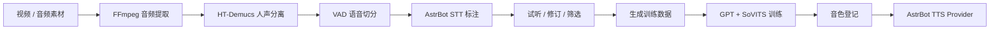

<div align="center">

# VoiceClone Flow

**从音视频素材到音色管理**

[](https://github.com/AstrBotDevs/AstrBot)
[](https://github.com/RVC-Boss/GPT-SoVITS)
[](CHANGELOG.md)
[](LICENSE)

</div>

一站式完成音视频素材的音频提取、人声分离、语音切分、STT 标注、片段审核、GPT-SoVITS 训练、音色登记和 AstrBot TTS Provider 接入，并支持多语言文字与语音消息组合。

本插件不是通用多模型训练平台，当前专注于 **GPT-SoVITS**。运行环境、模型、训练素材和音色成果均保存在 AstrBot 插件数据目录，不会写入插件源码或 Git 仓库。

## 核心能力

| 阶段 | 能力 |
| --- | --- |
| 素材处理 | 接收常见视频或音频格式，通过 FFmpeg 提取音频 |
| 人声准备 | 使用 HT-Demucs ONNX 模型分离人声，通过 VAD 切分有效语音 |
| 数据标注 | 调用 AstrBot 已配置的 STT Provider 批量生成文本标注 |
| 人工审核 | 逐段试听、修订文本、选择或排除训练片段 |
| 模型训练 | 生成 GPT-SoVITS 数据集，提供五档预设和自定义 Epoch |
| 音色管理 | 管理训练成果和外部音色，维护参考音频、参考文本与语言 |
| 平台接入 | 创建或更新 AstrBot `GSV TTS(Local)` Provider，并提供页面试听 |
| 消息输出 | 保留文字回复，按配置补发中文或日语语音，长回复按顺序分段发送 |

## 完整流程



## 开始前准备

### 运行要求

- AstrBot `>=4.24,<5`
- Windows 10/11
- 至少一个已经在 AstrBot 中启用的 **语音转文字（STT）Provider**
- GPT-SoVITS 训练建议使用 NVIDIA GPU；训练速度与显存占用受素材长度和训练档位影响
- 为 GPT-SoVITS 运行包、预训练模型和训练成果预留充足磁盘空间

FFmpeg、人声分离模型和 GPT-SoVITS 运行包均按需下载，不包含在插件市场安装包中。

### 必须先配置 STT Provider

STT Provider 用于把切分后的人声片段转换成 GPT-SoVITS 训练标注。插件复用 AstrBot Provider，不重复保存 API Key，也不自带语音识别模型。

1. 进入 AstrBot WebUI 的 **模型提供商**页面。
2. 新增并启用一个类型为**语音转文字 / STT** 的 Provider，可使用云端 API 或 AstrBot 支持的本地模型。
3. 打开 **插件管理 → GPT-SoVITS Voice Studio → 配置**。
4. 在 **语音识别 Provider** 中选择刚配置的 Provider 并保存。
5. 进入插件页面，确认素材表单中的 **ASR Provider** 下拉框可以正常显示该 Provider。

如果下拉框为空，请先检查 Provider 是否启用、类型是否为 STT，以及插件配置是否已经保存。

## 安装

### 从插件市场安装

在 AstrBot 插件市场搜索 `VoiceClone Flow`，安装后重载插件。

### 手动安装

```bash
cd AstrBot/data/plugins
git clone https://github.com/TKGEKKOU/astrbot_plugin_voice_clone_flow.git
```

返回 AstrBot 插件管理页重载插件，或重启 AstrBot。

## 快速开始

### 1. 准备运行环境

从插件管理页进入 **VoiceClone Flow** 页面，在顶部展开**运行环境**：

1. 检查 FFmpeg。插件会优先识别系统 PATH、常见安装位置和插件托管版本；未找到时点击下载。
2. 下载人声分离模型。
3. 下载并安装 GPT-SoVITS 运行包。安装包较大，下载和解压需要一定时间。
4. 安装完成后启动 GPT-SoVITS TTS 服务，页面应显示服务可用。

下载内容位于 AstrBot 插件数据目录，不会进入插件仓库。

### 2. 上传并处理素材

1. 在**素材处理任务**中选择视频或音频文件。
2. 选择已经配置好的 ASR Provider 和素材语言。
3. 勾选声音授权确认后开始处理。
4. 等待音频提取、人声分离、VAD 切片和批量 STT 标注完成。

素材语言决定训练标注的语言。请按素材实际语言选择中文、日语或英语，不要依赖模型自动猜测。

### 3. 审核训练片段

处理完成后，每个片段都可以直接播放：

- 删除背景音、串音、爆音或内容不完整的片段。
- 修正错字、漏字和标点，文本必须与实际语音一致。
- 保留发音清晰、音量稳定、角色音色一致的片段。
- 确认选择结果后点击**生成训练数据**。

训练数据质量通常比单纯增加训练轮数更重要。

### 4. 训练 GPT-SoVITS 音色

填写便于识别的音色名称，并选择训练档位：

| 档位 | GPT Epoch | SoVITS Epoch | 适用场景 |
| --- | ---: | ---: | --- |
| 轻量训练 | 5 | 10 | 最低可用配置，用于验证数据和训练链路 |
| 快速训练 | 10 | 20 | 低配置设备或快速迭代 |
| 标准训练 | 15 | 30 | 默认推荐，平衡速度和效果 |
| 增强训练 | 20 | 50 | 数据质量较好，希望进一步提升稳定性 |
| 精细训练 | 30 | 100 | 时间和算力充足时使用，效果不保证线性提升 |
| 自定义 | 自定义 | 自定义 | 已了解数据规模、过拟合和显存风险时使用 |

页面会显示当前训练阶段、Epoch、Step、step/s、预计剩余时间和日志摘要。训练期间不要关闭 GPT-SoVITS 进程或删除对应素材目录。

### 5. 登记音色并接入 AstrBot

训练完成后，在**在 AstrBot 中使用音色**区域：

1. 选择训练完成的音色。
2. 核对 GPT 模型、SoVITS 模型和语言。
3. 试听并按需修改**参考音频**与**参考音频文本**；二者必须完全对应。
4. 保存参考信息。
5. 点击**更新并启用此 TTS Provider**。

插件会创建或更新 ID 为 `voice_clone_flow_gsv` 的 `GSV TTS(Local)` Provider。之后仍需在 AstrBot 对应会话或配置中选择该 TTS Provider；进行语音输出前，请确保插件页面中的 GPT-SoVITS TTS 服务已经启动。

## 多语言文字与语音消息组合

当前版本针对角色对话提供以下组合：

| 可见文字 | 语音内容 | 行为 |
| --- | --- | --- |
| 中文 | 中文 | 先发送中文文字，再使用当前 TTS Provider 合成中文语音 |
| 中文 | 日语 | 先发送中文文字，再调用当前会话的聊天模型翻译为日语并补发日语语音 |

在插件配置的**中文文字与日语语音**区域设置：

- **启用中文文字 + 日语语音**：开启文字与语音分离输出。
- **语音目标语言 = 自动**：读取当前 TTS Provider 的 `text_lang`。
- **语音目标语言 = 中文**：直接朗读清理后的中文回复。
- **语音目标语言 = 日语**：使用当前会话的聊天模型生成日语语音副本，不修改可见中文回复。
- **单条语音最大字符数**：长回复按句切分为多条语音，并按原文顺序逐条发送。

日语翻译或语音合成失败时，已经生成的中文文字仍会正常发送，不会用错误语言继续朗读。该功能当前不是任意语言翻译器；市场描述中的“多语言文字与语音消息组合”特指上述已实现组合。

## 外部音色与参考信息

外部 GPT-SoVITS 训练成果可以放入：

```text
AstrBot/data/plugin_data/astrbot_plugin_voice_clone_flow/voices/
```

回到插件页面点击刷新，插件会尝试发现包含 GPT 权重、SoVITS 权重和参考音频的音色目录。导入后请检查语言、参考文本和文件路径，再更新 TTS Provider。

## 数据与清理

所有运行数据位于：

```text
AstrBot/data/plugin_data/astrbot_plugin_voice_clone_flow/
```

| 目录 | 内容 | 自动清理 |
| --- | --- | --- |
| `runtime/` | FFmpeg 与 GPT-SoVITS 运行环境 | 否 |
| `models/` | 人声分离模型 | 否 |
| `tasks/` | 素材处理任务和中间文件 | 按插件配置 |
| `voices/` | 训练成果和外部导入音色 | 否 |
| `logs/` | GPT-SoVITS 服务日志 | 按实际运行产生 |

默认每 24 小时检查一次过期临时素材。训练成果和已登记音色不会被自动删除。更新或迁移 AstrBot 前，建议备份 `voices/`。

## 常见问题

### ASR Provider 无法选择

确认 AstrBot 中已经创建并启用 STT Provider，然后在插件配置中选择并保存。聊天模型、TTS Provider 和 STT Provider 是三种不同类型，不能相互替代。

### 运行环境一直显示未就绪

展开顶部运行环境查看具体路径和错误。FFmpeg、人声分离模型、GPT-SoVITS 安装和 TTS 服务是独立状态，应逐项处理。

### 训练耗时很长

训练时间取决于 GPU、数据量和 Epoch。首次使用建议先运行轻量训练验证数据与链路，再逐步提高档位；更多 Epoch 不必然带来更好效果。

### 已更新 Provider 但没有语音

确认 GPT-SoVITS TTS 服务正在运行，并确认当前会话实际使用的是 `voice_clone_flow_gsv`。目标消息平台还必须支持 AstrBot `Record` 语音消息。

### 只有中文文字，没有日语语音

检查当前会话聊天模型是否可用、翻译超时设置、语音目标语言以及 TTS Provider 的 `text_lang`。翻译失败时插件按设计只发送中文文字。

## 音色授权与安全

仅处理你本人拥有或已获得明确授权的声音素材。请勿将克隆音色用于冒充、欺诈、骚扰、规避身份验证或其他违法用途。使用者应自行遵守所在地法律、素材许可和平台规则。

GPT-SoVITS、FFmpeg、人声分离模型和随插件提供的兼容补丁分别受其上游许可证约束，详见 [THIRD_PARTY_NOTICES.md](THIRD_PARTY_NOTICES.md)。

## 问题反馈

请通过 [GitHub Issues](https://github.com/TKGEKKOU/astrbot_plugin_voice_clone_flow/issues) 提交问题。建议附上 AstrBot 版本、插件版本、操作阶段和已脱敏的错误日志；请勿上传 API Key、未授权声音或私人训练素材。

## 许可证

本项目采用 [GNU Affero General Public License v3.0](LICENSE)。
