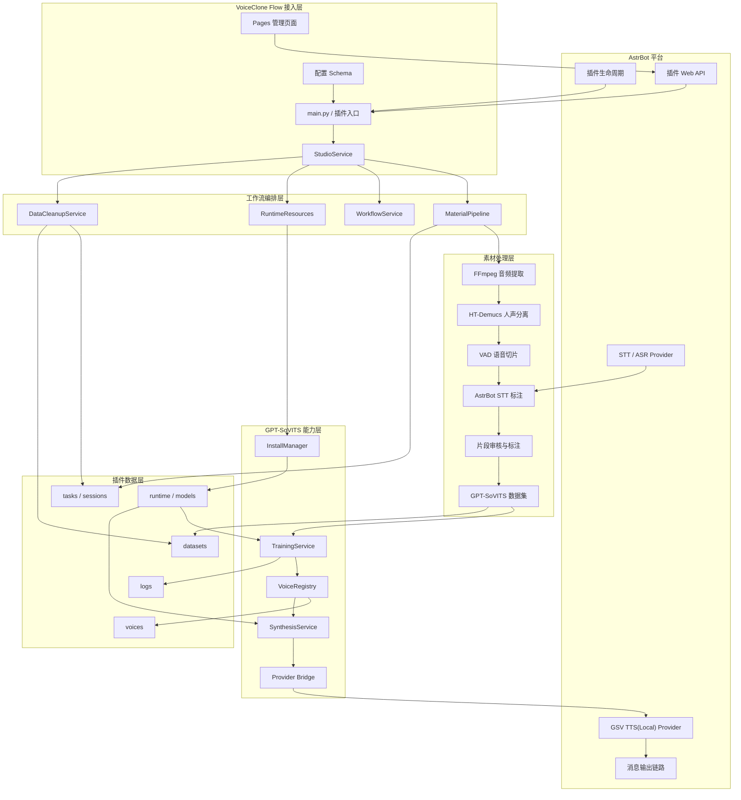
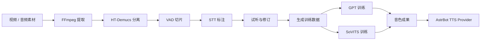
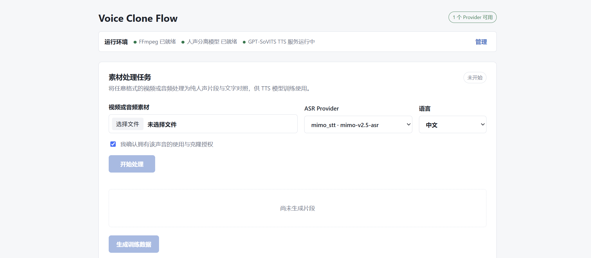
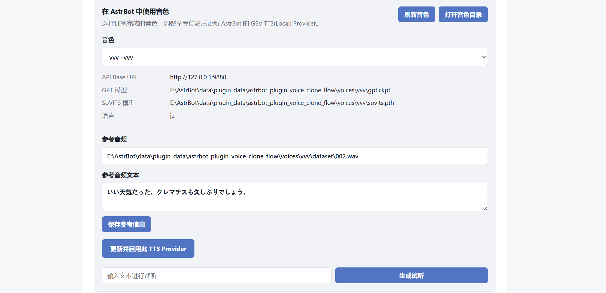

<div align="center">

# VoiceClone Flow

**从音视频素材到音色管理**

面向 AstrBot 的 GPT-SoVITS 音色生产、管理与接入插件。

[](CHANGELOG.md)
[](https://github.com/AstrBotDevs/AstrBot)
[](https://github.com/RVC-Boss/GPT-SoVITS)
[](#运行要求)
[](LICENSE)

[功能](#核心能力) · [架构](#架构总览) · [流程](#处理链路) · [安装](#快速开始) · [音色接入](#音色管理与-provider-接入) · [安全](#声音授权与安全)

</div>

VoiceClone Flow 将音视频素材处理、语音标注、GPT-SoVITS 训练、音色管理和 AstrBot TTS Provider 接入整合为一条完整工作流。

从一段视频或音频开始，插件可以完成音频提取、人声分离、语音切分、STT 标注、片段审核和模型训练，并将最终音色登记为 AstrBot 可直接使用的 `GSV TTS(Local)` Provider。

> [!IMPORTANT]
> 基于 **GPT-SoVITS v2Pro**。运行环境、模型、训练素材和训练结果文件统一保存在 AstrBot 插件数据目录。

> [!WARNING]
> 仅处理你本人拥有或已获得明确授权的音视频素材。

---

## 核心能力

| 能力 | 说明 |
| --- | --- |
| 音视频素材处理 | 通过 FFmpeg 从常见视频或音频格式中提取标准音频 |
| 人声分离与切片 | 使用 HT-Demucs ONNX 分离人声，通过 VAD 生成有效语音片段 |
| AstrBot STT 标注 | 复用 AstrBot 已配置的 STT Provider 批量生成训练文本 |
| 片段审核 | 支持逐段试听、文本修订、片段选择与训练数据生成 |
| GPT-SoVITS 训练 | 提供训练预设、自定义 Epoch、实时进度和训练日志 |
| 音色管理 | 管理训练成果与外部音色，维护参考音频、文本和语言 |
| Provider 接入 | 创建或更新 AstrBot `GSV TTS(Local)` Provider |
| 组合消息输出 | 支持中文文字配合中文或日语语音，长语音按顺序分段发送 |
| 生命周期管理 | 管理运行环境下载、TTS 服务启停和临时数据清理 |

---

## 架构总览



插件通过 AstrBot 原生能力完成以下接入：

- 使用插件生命周期完成加载、重载和资源释放。
- 使用 AstrBot Web API 提供独立管理页面。
- 使用 AstrBot STT Provider 完成训练素材标注。
- 创建或更新 AstrBot `GSV TTS(Local)` Provider。
- 在消息输出阶段补发中文或日语语音。

---

## 处理链路



处理链路采用可介入设计。用户可以在训练前试听每个片段、修改 STT 文本并排除不合格素材，避免错误标注直接进入模型训练。



---

## 音色管理与 Provider（模型提供商） 接入

训练完成后，插件会将 GPT 和 SoVITS 权重整理为独立音色，并自动获取：

- GPT 权重
- SoVITS 权重
- 参考音频
- 参考音频文本
- 音色语言
- 训练状态与来源

插件可以创建或更新以下 AstrBot Provider：

```text
Provider ID: voice_clone_flow_gsv
Provider 类型: GSV TTS(Local)
```

用户仍可在更新 Provider 前修改参考音频、参考文本和语言，确保推理配置与实际音色一致。



外部 GPT-SoVITS 音色也可以放入：

```text
AstrBot/data/plugin_data/astrbot_plugin_voice_clone_flow/voices/
```

返回插件页面刷新后，即可发现并登记外部音色。

---

## 多语言文字与语音消息

VoiceClone Flow 支持将文字消息与语音内容分离处理。

| 可见文字 | 语音内容 | 输出方式 |
| --- | --- | --- |
| 中文 | 中文 | 先发送中文文字，再补发中文语音 |
| 中文 | 日语 | 先发送中文文字，翻译后补发日语语音 |

长回复会按句切分为多条语音，并按照原文顺序依次发送。

翻译或语音合成失败时，插件只保留中文文字消息，不会使用错误语言继续合成。

---

## 快速开始

### 运行要求

- AstrBot `>=4.24,<5`
- Windows 10/11
- AstrBot 中已启用的语音转文字（STT/ASR）Provider
- 足够的磁盘空间用于运行包、模型和训练成果
- 建议使用 NVIDIA GPU 进行 GPT-SoVITS 训练和推理

FFmpeg、人声分离模型和 GPT-SoVITS 运行包均按需下载，不包含在插件仓库或插件市场安装包中。

### 安装

在 AstrBot 插件市场搜索 `VoiceClone Flow`，或手动安装：

```bash
cd AstrBot/data/plugins
git clone https://github.com/TKGEKKOU/astrbot_plugin_voice_clone_flow.git
```

安装后在 AstrBot 插件管理页重载插件。

### 基础配置

1. 在 AstrBot“模型提供商”页面启用一个 STT Provider。
2. 在 VoiceClone Flow 插件配置中选择对应的 ASR Provider。
3. 进入插件页面准备 FFmpeg、人声分离模型和 GPT-SoVITS 运行环境。
4. 上传素材并完成片段审核与训练。
5. 登记音色并更新 `voice_clone_flow_gsv` Provider。

插件复用 AstrBot Provider，不重复保存 STT API Key。

---

## 数据目录

插件运行数据统一保存在：

```text
AstrBot/data/plugin_data/astrbot_plugin_voice_clone_flow/
```

| 目录 | 内容 | 自动清理 |
| --- | --- | --- |
| `runtime/` | FFmpeg 和 GPT-SoVITS 运行环境 | 否 |
| `models/` | 人声分离模型 | 否 |
| `downloads/` | 运行环境下载缓存 | 安装成功后清理 |
| `tasks/` | 素材处理任务与中间文件 | 按插件配置 |
| `datasets/` | GPT-SoVITS 训练数据 | 按任务状态 |
| `voices/` | 训练成果与外部音色 | 否 |
| `logs/` | 服务与训练日志 | 按运行产生 |

临时任务数据会定期清理，训练完成的音色不会被自动删除。

迁移或更新 AstrBot 前，建议备份：

```text
AstrBot/data/plugin_data/astrbot_plugin_voice_clone_flow/voices/
```

---

## 声音授权与安全

<details>
<summary><strong>使用本插件前请阅读</strong></summary>

本插件仅用于处理你本人拥有或已经获得明确授权的声音素材。

不得使用本插件：

1. 冒充、误导或欺骗他人。
2. 生成、传播未经授权的语音。
3. 实施诈骗、骚扰、诽谤或身份欺骗。
4. 绕过平台风控、身份验证或内容审核。
5. 从事违反法律法规、平台规则或素材许可的行为。

如果你不确定某个声音样本是否允许使用，请不要上传、训练或合成。

使用者应自行确认声音素材的授权范围，并承担因使用本插件产生的相应责任。

</details>

GPT-SoVITS、FFmpeg、人声分离模型及兼容补丁分别受其上游许可证约束，详见 [THIRD_PARTY_NOTICES.md](THIRD_PARTY_NOTICES.md)。

---

## 问题反馈

提交问题时，请附上 AstrBot 版本、插件版本、操作阶段、复现步骤和已脱敏日志。

请勿公开上传 API Key、未授权声音、私人训练素材或包含个人隐私的日志。

- GitHub Issues：[提交问题](https://github.com/TKGEKKOU/astrbot_plugin_voice_clone_flow/issues)
- QQ：**3198260896**

---

## 开源协议

本项目采用 [GNU Affero General Public License v3.0](LICENSE)。

<div align="center">
  
</div>
