# VoiceClone Flow 通信与部署说明

本文说明 QQ、NapCat、AstrBot、VoiceClone Flow 插件、本机 VoiceClone Studio、FRP 和 GPT-SoVITS 之间的通信关系及配置方法。

## 整体通信链路

```mermaid
flowchart LR
    QQ[QQ 用户] <-->|QQ 协议| NC[NapCat]
    NC -->|OneBot v11 反向 WebSocket| AB[AstrBot]
    AB -->|调用远程 TTS Provider| PL[VoiceClone Flow 插件]
    PL -->|HTTP 127.0.0.1:19090| FS[服务器 FRPS 映射端口]
    FS <-->|FRP 控制连接| FC[本机 FRPC]
    FC -->|HTTP 127.0.0.1:9090| VS[VoiceClone Studio]
    VS -->|HTTP 127.0.0.1:17005| GSV[GPT-SoVITS v2Pro]
```



三条链路相互独立：

1. NapCat 与 AstrBot 负责 QQ 消息收发。
2. FRP 负责让服务器上的插件访问本机 Studio。
3. Studio 负责音色、训练与推理，并在本机调用 GPT-SoVITS。

NapCat 不连接 Studio，也不使用 FRP Token 或 Studio Token。

## 端口与角色

| 端口 | 所在位置 | 服务 | 用途 |
| --- | --- | --- | --- |
| `6199` | AstrBot 服务器 | OneBot v11 反向 WebSocket | NapCat 连接 AstrBot |
| `7001` | 云服务器 | FRPS 控制端口 | 本机 FRPC 登录服务器 FRPS |
| `19090` | 云服务器 | FRPS TCP 映射端口 | AstrBot 插件访问本机 Studio |
| `9090` | 本机 | VoiceClone Studio | Studio 页面和 API |
| `17005` | 本机 | GPT-SoVITS | Studio 调用推理服务 |

这些端口是当前部署示例，可以自定义，但所有通信两端必须保持一致。

## NapCat 与 AstrBot

### AstrBot

在 AstrBot 中创建或编辑 QQ/OneBot 消息平台：

| 配置项 | 填写值 |
| --- | --- |
| 消息平台 | `aiocqhttp` / OneBot v11 |
| 启用 | 开启 |
| 反向 WebSocket 主机 | `0.0.0.0` |
| 反向 WebSocket 端口 | `6199` |
| 反向 WebSocket Token | 自定义强 Token |

`0.0.0.0` 是监听地址，不能作为 NapCat 的连接 URL。

### NapCat

在 NapCat WebUI 的网络配置中创建 WebSocket Client：

| 配置项 | 填写值 |
| --- | --- |
| 启用 | 开启 |
| URL | `ws://127.0.0.1:6199/ws` |
| Token | 与 AstrBot 反向 WebSocket Token 一致 |
| 消息格式 | `Array` |
| 心跳间隔 | `30000` ms |
| 重连间隔 | `30000` ms |
| SSL 证书验证 | `ws://` 下不生效；仅 `wss://` 使用 |

上述 URL 适用于 NapCat 与 AstrBot 共享服务器网络命名空间的情况。

如果两者位于不同 Docker 容器，应将容器加入同一 Docker 网络，并将 URL 改为：

```text
ws://<AstrBot 服务名>:6199/ws
```

如果 NapCat 在容器中而 AstrBot 端口发布到宿主机，可使用宿主机私网地址；不要在无法确认网络边界时直接向公网开放 `6199`。

## 插件与 Studio

### 云服务器插件

VoiceClone Flow 选择远程连接模式：

| 配置项 | 填写值 |
| --- | --- |
| Studio 地址 | `http://127.0.0.1:19090` |
| Studio Token | 与本机 Studio Token 一致 |
| 超时 | `300` 秒 |

这里的 `127.0.0.1` 指云服务器本机。插件不应填写本机电脑的 `127.0.0.1:9090`。

### 本机 Studio

在“连接 AstrBot”中填写：

| 配置项 | 示例 |
| --- | --- |
| Studio Token | 自定义强 Token |
| 服务器地址 | `<SERVER_PUBLIC_IP>` |
| FRPS 控制端口 | `7001` |
| FRP Token | 与服务器 FRPS Token 一致 |
| 本机 Studio 端口 | `9090` |
| 服务器映射端口 | `19090` |
| 代理名称 | `voiceclone-studio` |

操作顺序：

1. 保存 Studio Token。
2. 测试本机 Studio。
3. 保存连接配置并准备 FRPC。
4. 启动连接。
5. 等待状态显示“第 4 步 / 4：FRPC 已连接”。
6. 回到服务器插件测试连接并同步远程音色。

## Token 对应关系

| Token | 两端必须一致 | 用途 |
| --- | --- | --- |
| OneBot Token | AstrBot ↔ NapCat | QQ 消息链路鉴权 |
| Studio Token | AstrBot 插件 ↔ Studio | Studio HTTP API 鉴权 |
| FRP Token | FRPS ↔ FRPC | FRP 客户端登录鉴权 |

三种 Token 相互独立。建议分别生成随机值，不要在公开仓库、截图或日志中记录真实 Token。

## 语音请求流程

启用中文文字与日语音色组合输出时：

1. QQ 用户发送消息。
2. NapCat 将事件通过 OneBot WebSocket 发送给 AstrBot。
3. AstrBot 生成中文回复。
4. VoiceClone Flow 保留中文文字，同时使用 AstrBot 当前 LLM 将语音副本翻译为日语。
5. 远程 GSVI Provider 请求服务器 `127.0.0.1:19090`。
6. FRP 将请求转发至本机 Studio `127.0.0.1:9090`。
7. Studio 调用本机 GPT-SoVITS `127.0.0.1:17005`。
8. 音频沿原路径返回，AstrBot 通过 NapCat 发送 QQ 语音。

Studio 页面中的“推理测试”是直连测试；服务器聊天中的翻译逻辑由 AstrBot 插件执行。

## 验证方法

### 1. NapCat 与 AstrBot

- NapCat WebSocket Client 显示已连接。
- AstrBot 消息平台显示在线。
- QQ 可以与机器人正常收发文字。

### 2. 服务器访问 Studio

在服务器执行：

```bash
curl -i \
  -H "Authorization: Bearer <STUDIO_TOKEN>" \
  http://127.0.0.1:19090/api/health
```

预期 HTTP 状态为 `200`，响应包含 `"status":"ok"`。

### 3. Studio 与 GPT-SoVITS

Studio 页面应显示 GPT-SoVITS 可推理。本机应监听：

```text
127.0.0.1:9090
127.0.0.1:17005
```

### 4. 音色同步

1. Studio 音色目录中至少存在一个状态为 `ready` 的音色。
2. 服务器插件点击“同步远程音色”。
3. 插件显示同步数量大于零。
4. AstrBot Provider 列表出现 `voice_clone_flow_remote_<voice_id>`。

## 常见故障

### FRPC 停在第 3 步

查看 `E:\VCS\data\frp\frpc.log`。

如果出现：

```text
proxy [voiceclone-studio] already exists
```

说明旧 FRPC 仍占用同名代理。只终止确认属于 `E:\VCS\data\frp\frpc.exe` 的旧进程，再重新启动连接；不要按端口批量结束其他 FRP 服务。

### 插件显示同步 0 个音色

- 检查 Studio 音色目录是否包含音色。
- 音色目录至少需要 `gpt.ckpt`、`sovits.pth`、参考 WAV 和训练清单。
- 在 Studio 刷新音色，再在服务器插件同步。

### 文字正常但没有语音

按顺序检查：

1. 远程 Provider 是否启用。
2. Studio 是否为第 4 步连接成功。
3. GPT-SoVITS 是否正在运行。
4. 音色是否为 `ready`。
5. AstrBot 日志是否出现翻译或 TTS Provider 错误。

## 安全建议

- 验收后更换所有曾出现在截图、聊天记录或终端历史中的 Token。
- `19090` 只供云服务器本机 AstrBot 使用，不在云安全组中向公网开放。
- `9090` 和 `17005` 只监听本机回环地址。
- `7001` 只允许可信来源访问，并使用独立强 Token。
- `6199` 优先限制在本机或 Docker 内部网络，不直接暴露公网。
